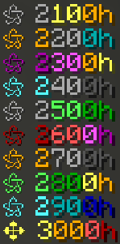
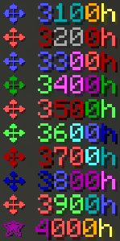
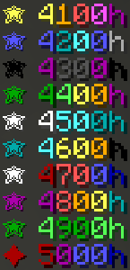

# StatsMods Minecraft 1.21.1 — Fabric, Forge & NeoForge

### All mods are server-side (not required on client).

---

## StatsCore (v0.7)

Library Mod required for all Statistics Mods.
All total stats are read from the normal Minecraft stats directory. Daily stats are calculated and saved in `dailyStats.json`, located in a world's directory.

### `/statscore help`
Run `/statscore` or `/statscore help` for an in-game overview of every subcommand: the leaderboard commands provided by whichever Statistics Mods are installed, plus the admin-only `/statscore` config subcommands (only shown to OPs).

## Playtime Leaderboard (v0.7)
#### (StatsCore Version 0.7)

A mod for Minecraft 1.21.1 (Fabric/Forge/NeoForge) that adds a `/playtime` command to display playtime statistics for all players (online and offline) on a server or singleplayer world. The mod provides a detailed, formatted leaderboard with customizable colors, podium ranks, and alignment for an enhanced user experience.

### Features

#### `/playtime` Command
- **Accessible to All Players**: Requires no permission, so anyone can use it.
- **Shows Playtime for All Players**:
  - Displays playtime for both online and offline players.
  - Hover over the hours display to see the time spent on this world today (Reset time can be configured)
  - Sorts players by playtime in descending order (highest to lowest).
  - Setting colors for specific usernames and blacklisting players from leaderboard is possible in the config (see `Configuration`)
- **Command cooldown**:
  - Default 5 second cooldown between command uses (configurable)

#### Formatting
- **Days Display**:
  - For players with 100+ hours, shows days in parentheses (e.g., `(54.17d)`).
- **Hours Decimal Display**:
  - Below 1000h: Displays hours with 2 decimal places (e.g., `493.15h`).
  - At or above 1000h: Displays hours as integers (e.g., `1300h`).
- **Color Coding**: Inspired by Hypixel Bedwars star prestige colors, all the way up to 5000.

## Distance Leaderboard (v0.5)
#### (Statscore Version 0.7)

Same applies here, just for distance traveled displayed in km.
This Mod does not include a Stats Color Coding feature! (only player names, which is a feature of StatsCore)

#### Automatic Overflow Handling
Each of the 15 distance-related vanilla stats the mod tracks (walking, sprinting, elytra, boats, etc.) is stored by Minecraft as a 32-bit number, which caps out at ~21,474km. On a long-running world a dedicated player *will* eventually hit that ceiling. StatsCore now watches for this automatically: once a stat gets close to the limit, it resets that individual stat back to 0 and transparently bumps the player's overflow counter so their leaderboard total stays correct. The affected player gets a chat message explaining what happened. This makes the leaderboard safe to run indefinitely on long-term servers.

The manual `/statscore intlimit` command (see `Configuration` below) still exists as a fallback for correcting historical data from before this feature existed, but you shouldn't need it going forward.

## Death Leaderboard (v0.4)
#### (Statscore Version 0.7)

Same applies here, just for number of deaths per player.
This Mod does not include a Stats Color Coding feature! (only player names, which is a feature of StatsCore)

### Playtime/Death-Ratio
Displays this additional Statistic next to a player's death stat.

## Kill Leaderboard (v0.4)
#### (Statscore Version 0.7)

Same applies here, just for player (PvP) kills.
This Mod does not include a Stats Color Coding feature! (only player names, which is a feature of StatsCore)

## Leaderboard Pagination
All four leaderboard commands (`/playtime`, `/distance`, `/deaths`, `/playerkills`) show 10 players per page. If there are more than 10 eligible players, a page footer with clickable `<--` / `-->` arrows appears below the list — click an arrow, or run e.g. `/playtime 2`, to jump to that page.

## Configuration (using StatsCore)
- **Config File**: `config/statscore_config.json` (DO NOT EDIT THIS FILE!)

The configuration can be edited by using the `/statscore` command (OP is required for the subcommands below, except `color` on your own name; `/statscore help` itself is open to everyone).

- **Custom Username Colors**: Every player can change their *own* leaderboard name color; only OPs can change other players' colors.
-  `/statscore color <player>` Shows the currently configured color of the specified player (viewable by anyone).
-  `/statscore color <player> set <color>` Sets a player's leaderboard name color. Non-OPs may only target their own name.
-  `/statscore color <player> reset` Resets a player's color to white. Non-OPs may only target their own name.

- **Blacklist Players**: Exclude specific players from the leaderboards.
-  `/statscore blacklist list` Shows all blacklisted players.
-  `/statscore blacklist add <player>` Adds a player to the blacklist.
-  `/statscore blacklist remove <player>` Removes a player from the blacklist.

- **Daily Reset Time**: Configure the Daily Statistics Reset Time (UTC+0).
-  `/statscore daily_reset_time` Shows the currently configured time.
-  `/statscore daily_reset_time set <HH:mm:ss UTC>` Changes the time to the specified time.

- **Command Cooldown**: Configure the cooldown between command uses.
- `/statscore cooldown` Shows the currently configured value.
- `/statscore cooldown set <seconds>` Changes the cooldown to the specified value.

- **Reloading Config**:
-  `/statscore reload` Reloads the config.

#### Advanced
- **Integer Limit**: As of v0.7, distance stat overflow is handled automatically (see `Distance Leaderboard` above). This command remains as a manual fallback/inspection tool.
- `/statscore intlimit <player>` Shows the amount of Integer Limits a player has.
- `/statscore intlimit <player> set <amount>` Sets the players Integer Limit to specified amount.

---

### Future Plans
- Mod for Status (AFK, BUSY, etc.), other Stats related Mods

### License
- This mod is released under the [MIT License](LICENSE). Feel free to use, modify, and distribute it as per the license terms.